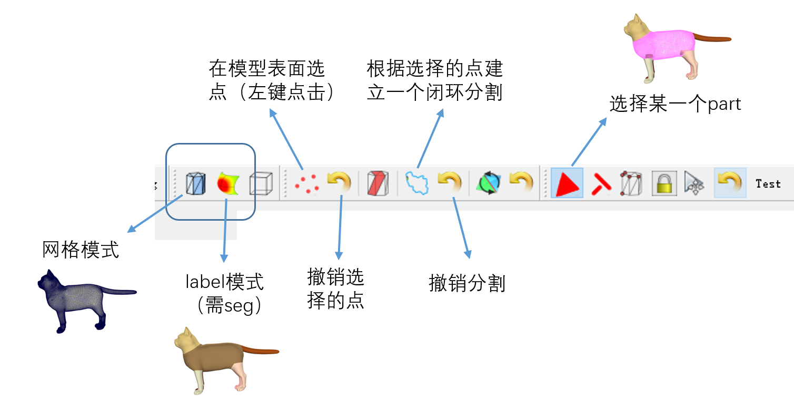
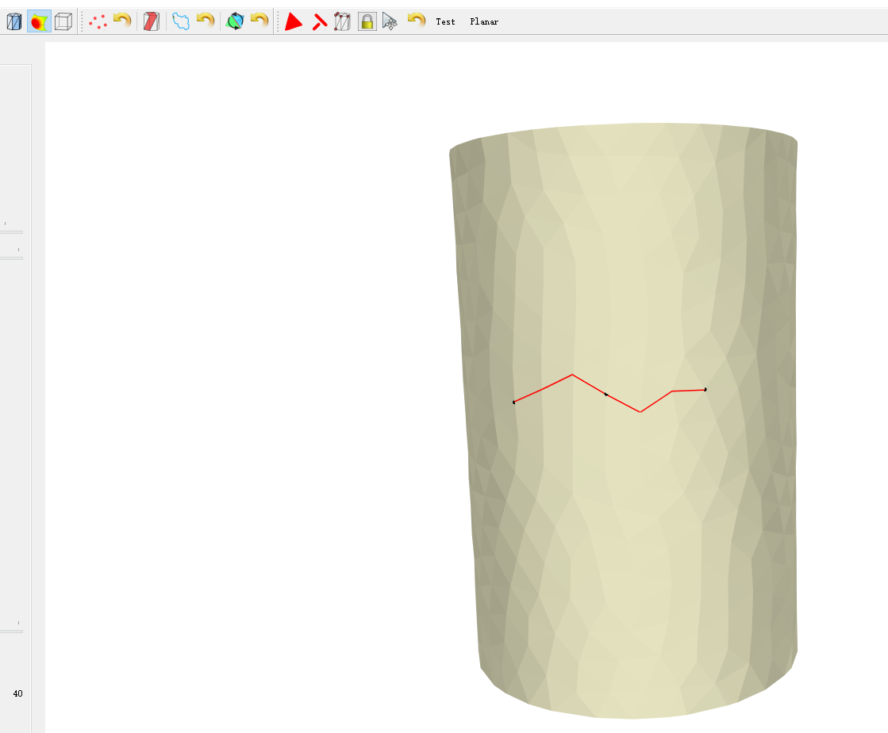
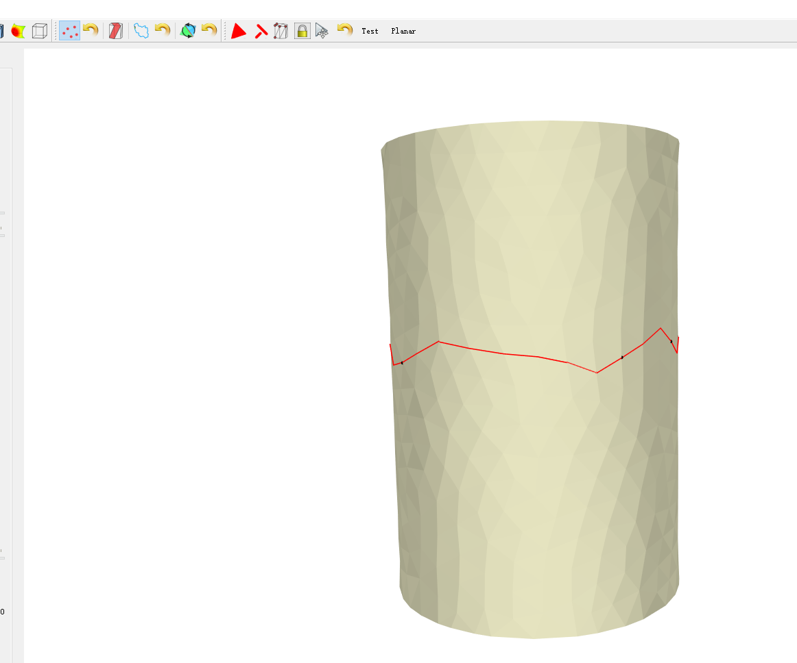
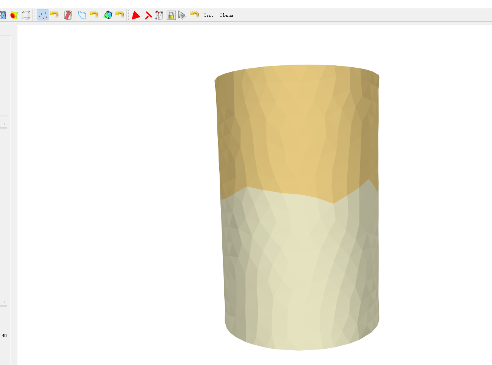
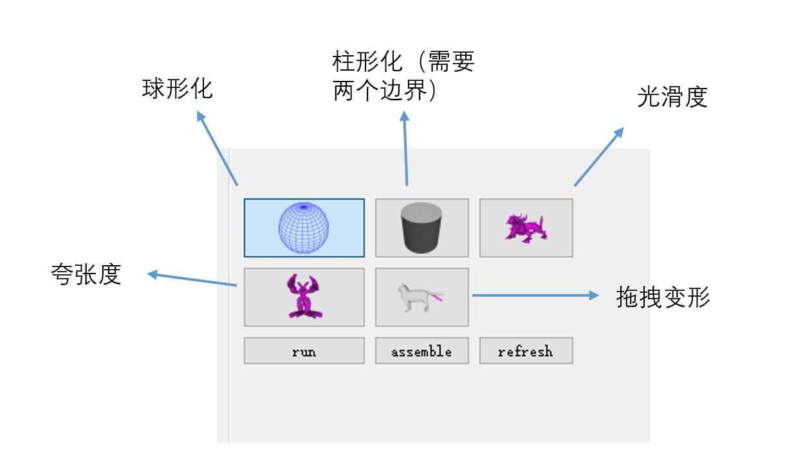
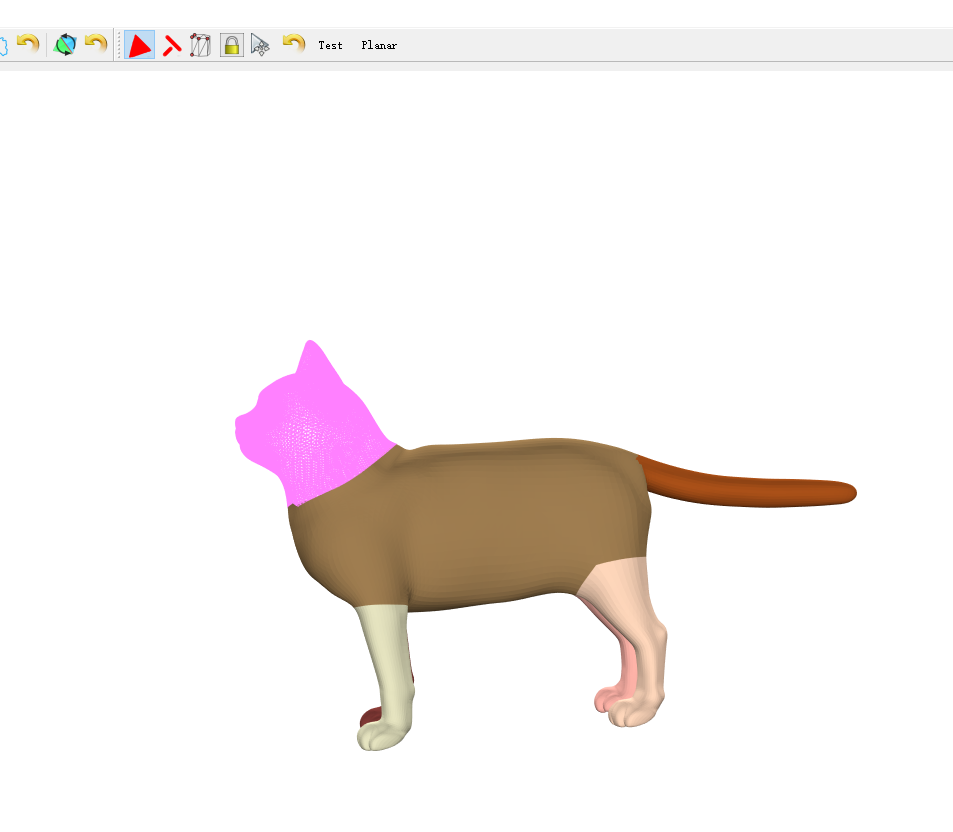
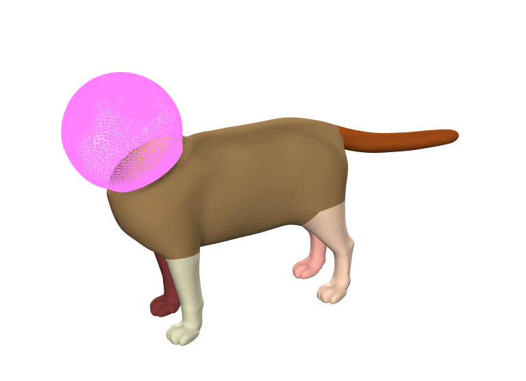

按钮说明：

操作说明：

1. 对模型建立分割

   在label模式下通过选点按钮在模型表面有顺序的选择一系列路径点，算法自动建立它们之间的最短路径

   

   切回label模式可以进行旋转（按住鼠标左键），点击选点按钮添加新的路径点（最后一个点与最初的点重合）形成闭环

   

   点击建立闭环分割的按钮

   

2. 对分割进行变形

   选择变形类型，默认球形参数化

   

   选择头部part

   

   run 执行(点击refresh可以撤销这一次的变形)

   

assemble拼接(拼接之后目前的代码无法通过refresh回上一步状态)

